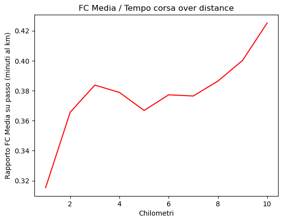

# Analisi-corsa-10k
In questa breve analisi vorrei spiegare il processo per importare i dati di una corsa da Garmin Connect e la loro visualizzazione con Pandas e Matplotlib.

Inizialmente importo le librerie di Pandas e Matplotlib, poi sfrutto il comando pd.read_csv di Pandas per importare il csv nel mio notebook.
Il csv si può scaricare facilmente dal sito Garmin Connect: si può esportare csv di una singola attività (come in questo caso), oppure il database di tutte le attività effettuate con i valori riassuntivi delle singole gare.

Qui di seguito alcune delle principali variabili statistiche.

| Lap | Tempo cumulato         | Distanza | Passo medio | FC Media | FC max | Cadenza di corsa media | Lunghezza media passo |
|:---:|:----------------------:|:--------:|:-----------:|:--------:|:------:|:----------------------:|:---------------------:|
| 1   | 0 days 00:07:08.100000 | 1.00     | 7:08        | 135.0    | 149    | 161                    | 0.87                  |
| 2   | 0 days 00:13:58        | 1.00     | 6:50        | 150.0    | 154    | 160                    | 0.92                  |
| 3   | 0 days 00:20:45        | 1.00     | 6:47        | 156.0    | 161    | 158                    | 0.93                  |
| 4   | 0 days 00:27:39        | 1.00     | 6:54        | 157.0    | 163    | 158                    | 0.91                  |
| 5   | 0 days 00:34:47        | 1.00     | 7:08        | 157.0    | 161    | 156                    | 0.90                  |
| 6   | 0 days 00:41:51        | 1.00     | 7:04        | 160.0    | 164    | 156                    | 0.91                  |
| 7   | 0 days 00:49:02        | 1.00     | 7:10        | 162.0    | 166    | 156                    | 0.89                  |
| 8   | 0 days 00:56:06        | 1.00     | 7:04        | 164.0    | 167    | 157                    | 0.90                  |
| 9   | 0 days 01:03:06        | 1.00     | 7:00        | 168.0    | 170    | 159                    | 0.90                  |
| 10  | 0 days 01:09:48        | 1.00     | 6:42        | 171.0    | 177    | 162                    | 0.92                  |

## Plot
Grafico sull'andamento del battito cardiaco all'interno di una singola corsa di 10k  
Come ci si può aspettare la frequenza cardiaca media aumenta all'aumentare della distanza percorsa.

Rapporto FC Media su passo in base a chilometri percorsi

